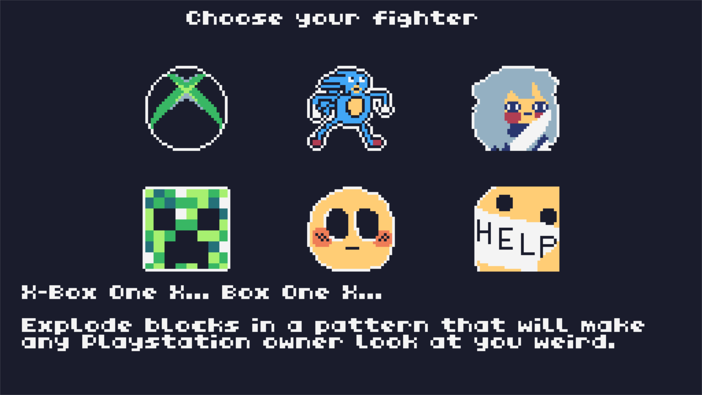
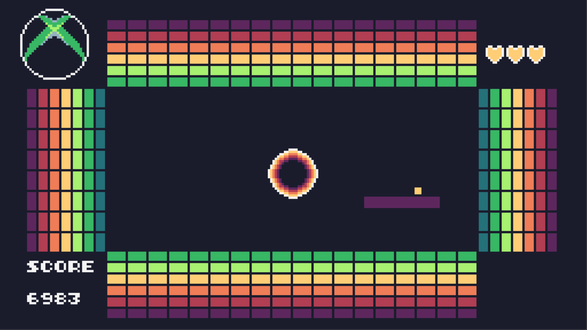
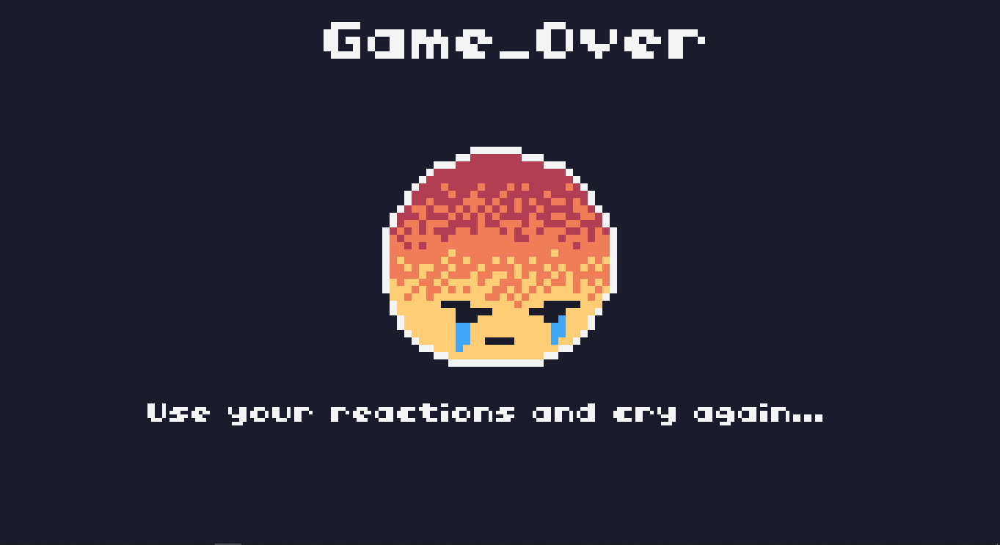
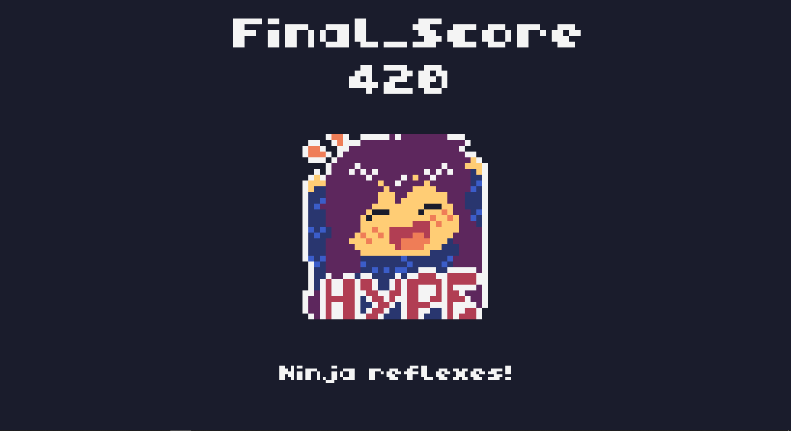

# Break_In

  
   

  
   

  
  
  

This game was developed for the fourth edition of the [Retro Jam](https://itch.io/jam/retrojam2021/entries) event organized by the IEEE University of Porto Student Branch. 

It was developed during a 48 hour period for the [TIC-80](https://tic80.com/) fantasy console.

**Theme:** Reaction

## Concept

A different take on the popular game *Breakout* with 360º fields of blocks surrounding and character powerups!

Now your reactions have to be even quicker to suceed in this challenging game, breaking all the blocks without letting your ball be caught by the menacing black hole!
 
## Controls 🎮

### Menu

- **Arrows -** Select
- **Z -** Confirm
- **Esc -** Go back

### Gameplay 

- **Arrows -** Move paddle in all directions
- **A -** Release ball
- **Z -** Rotate paddle anti-clockwise
- **X -** Rotate paddle clockwise
- **S -** Use powerup

## Team 👥

- Bárbara Pinto ([@MadDinosaur](https://github.com/MadDinosaur)) - art, code
- Eduardo Correia ([@educorreia932](https://github.com/Educorreia932)) - code
- Manuel Cerqueira da Silva ([@ManelMCCS](https://github.com/ManelMCCS)) - music, code
- Miguel Xavier Santos ([@xavier-santos](https://github.com/xavier-santos)) - music, code
